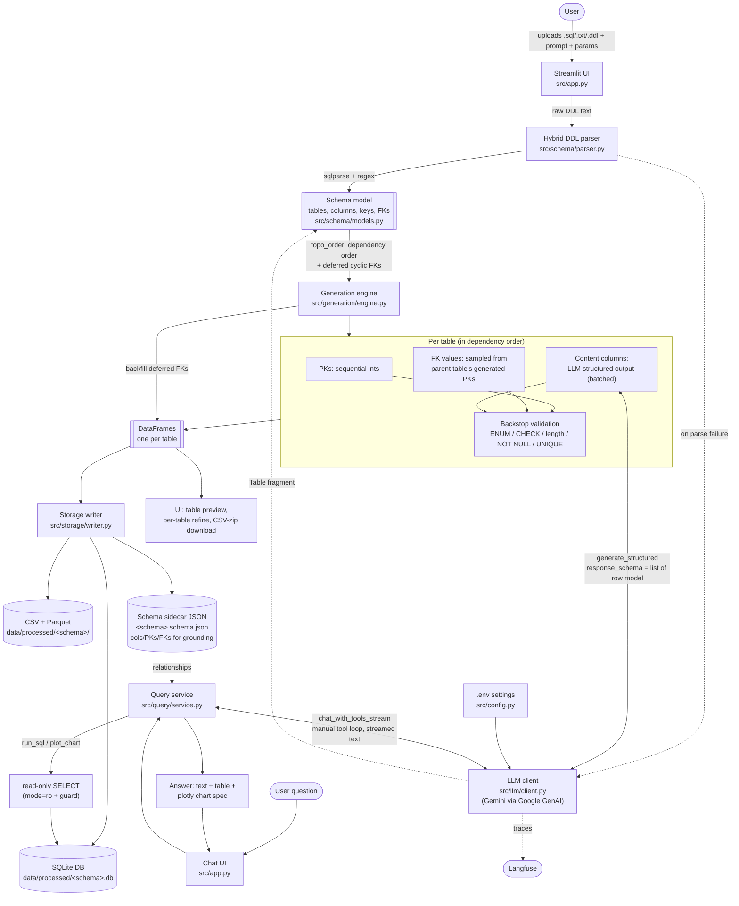

# Architecture (current)

How a DDL upload becomes generated, persisted data (Phase 1), and how that data is then queried in
natural language (Phase 2). The Phase 2 flow is at the bottom of the diagram.

**Key principle:** the LLM generates *content only*; keys and relationships are produced in code
(sequential PKs, FK values sampled from parent PKs), so referential integrity is guaranteed rather
than trusted to the model.
