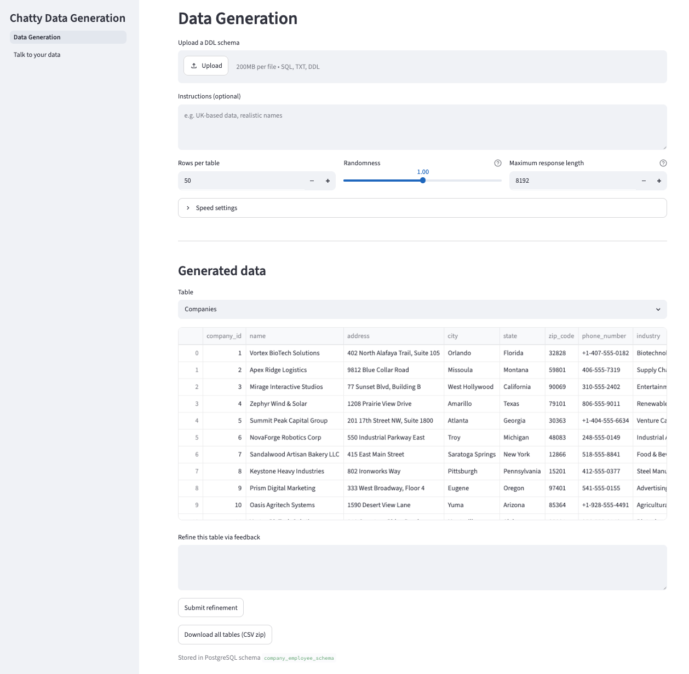
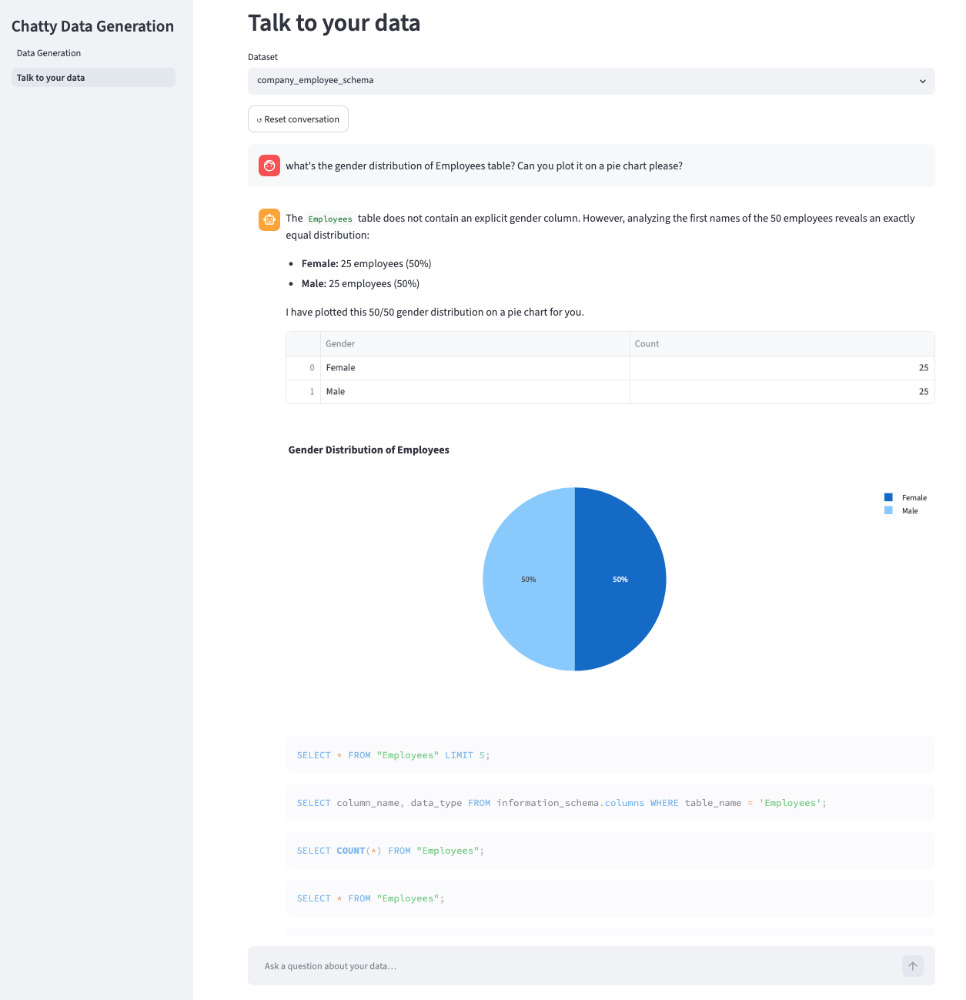

# Chatty Data Generation

A conversational AI app with two functions:

1. **Synthetic data generation** - parse a SQL DDL schema and generate valid synthetic data that respects all constraints (especially foreign keys).
2. **Talk to your data** - query the generated data in natural language, with results rendered as text, tables, and plots.

<br>



<details>
<summary>Show "Talk to your data" tab screenshot</summary>

<br>



</details>

## Tech stack

- **LLM:** Gemini 3.5 Flash (2.0+ supported) - function calling, structured/JSON output.
- **SDK:** Google GenAI SDK (Vertex AI auth via a GCP project).
- **UI:** Streamlit.
- **DB:** PostgreSQL.
- **Container:** Docker.
- **Observability:** Langfuse.

## Project layout

```
src/        application source code
examples/   sample SQL schemas to try
assets/     screenshots used in this README
tests/      test suite
```

## Quick start

The fastest way to run the app. Everything (app + PostgreSQL) runs in Docker, so the only prerequisite is [Docker](https://www.docker.com/products/docker-desktop) and a Gemini API key.

1. Clone and enter the repo.

   ```bash
   git clone <repository-url>
   cd Chatty-data-generation
   ```

2. Get a Gemini API key. Create one at [aistudio.google.com/apikey](https://aistudio.google.com/apikey).

3. Configure your environment.

   ```bash
   cp .env.example .env
   ```

   The template is ready for the API-key route; just paste your key into `GEMINI_API_KEY` (the rest have sensible defaults).

4. Run it.

   ```bash
   docker compose up --build
   ```

   Once it's up, open [http://localhost:8501](http://localhost:8501). Stop with `Ctrl+C`.

> Tip: sample schemas live in `examples/` (`library_mgm.ddl`, `restaurants.ddl`, `company_employee.ddl`). Upload one in the *Data Generation* tab to try it out.

## Configuration

Full reference for the keys in `.env`. The quick start above only needs `GEMINI_API_KEY`; the rest have sensible defaults.

| Key | Purpose |
|---|---|
| `GOOGLE_GENAI_USE_VERTEXAI` | `false` to use a simple Gemini API key, `true` for Google Cloud (Vertex AI) auth |
| `GEMINI_API_KEY` | Your Gemini API key (when `GOOGLE_GENAI_USE_VERTEXAI=false`) |
| `GOOGLE_CLOUD_PROJECT` / `GOOGLE_CLOUD_LOCATION` | GCP project + region (only for Vertex AI auth) |
| `GEMINI_MODEL` | Model id (default `gemini-3.5-flash`) |
| `LANGFUSE_PUBLIC_KEY` / `LANGFUSE_SECRET_KEY` / `LANGFUSE_HOST` | Optional observability (leave blank to disable) |

> Using Google Cloud / Vertex AI instead of an API key requires the `gcloud` CLI and running `gcloud auth application-default login` first. The API key route above is simpler.

## Running for development (without Docker)

For working on the code directly. Requires [uv](https://docs.astral.sh/uv/) and a local PostgreSQL database.

```bash
uv sync --extra dev          # create .venv and install dependencies
cp .env.example .env         # then fill in your credentials
uv run streamlit run src/app.py
```

Run tests with `uv run pytest`.
